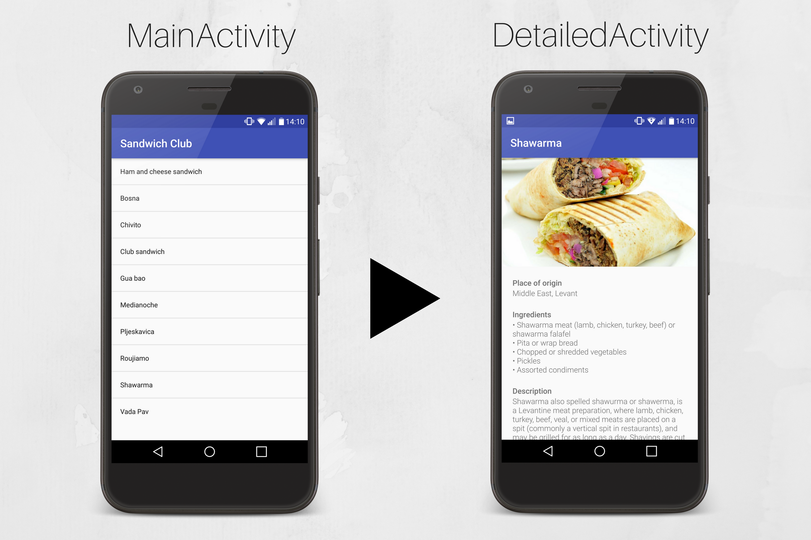

# Sandwich Club
This is the 1st project of the [Android Developer Nanodegree at Udacity](https://eu.udacity.com/course/android-developer-nanodegree-by-google--nd801).
## Description
Sandwich Club is an app which provides you some interesting information about well-known sandwiches. It consists of a MainActivity with a list of all the sandwiches and a DetailedActivity where you can view details about the sandwich you have clicked on.
## How It Works

1. When you click on a Sandwich in the main activity, there is an Intent to the detailed activity with the position of the item you have clicked on.
2. Than a JSON string with this position is exported from a String array (which is stored in resources > values > strings.xml).
3. This JSON String is passed into a method which gets required data from JSON and returns a custom object called Sandwich.
4. And at the end. the data is exported from our Sandwich object (using 'get' methods) and passed into individual TextViews.

## Project Status
 - The project is completed
 - The project has been successfully reviewed
 - The project has met all the requirements
## Used Libraries
1. [Picasso](http://square.github.io/picasso/) for displaying images from URL
2. [ButterKnife](https://github.com/JakeWharton/butterknife) for binding views.
